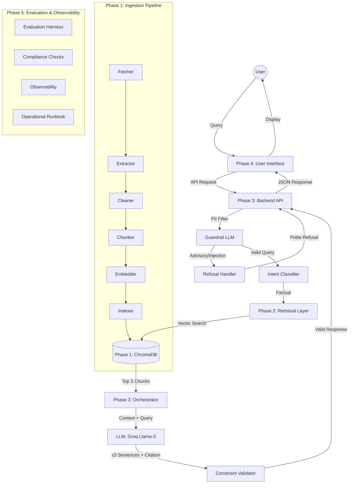

# Mutual Fund FAQ Assistant: Detailed Phase-Wise Architecture

This document outlines the architectural roadmap for building a facts-only Retrieval-Augmented Generation (RAG) assistant for mutual fund schemes, based on the Groww reference context.

---

## **Phase 0 — Foundation & Governance (Day 0)**
*Purpose: Lock down scope, sources, and guardrails before writing code.*

- **0.1 Target Asset Management Company (AMC)**:
    - **HDFC Mutual Fund** (via Groww context)
- **0.2 Whitelisted URL Corpus (5 Schemes)**:
    - Select 5 representative HDFC mutual fund schemes from Groww ensuring category diversity (e.g., large-cap, flexi-cap, ELSS, debt, hybrid)
    - Placeholder URLs to be finalized during Phase 0 execution
- **0.3 Guardrails Definition**:
    - **Content Policy**: Facts-only, no investment advice, no recommendations
    - **Response Constraints**: Maximum 3 sentences per answer, exactly one source citation
    - **Privacy Policy**: No PII collection (PAN, Aadhaar, phone numbers, email)
    - **Source Policy**: Only official public sources (AMC, AMFI, SEBI)
- **0.4 Technical Stack Selection**:
    - Embeddings: OpenAI `text-embedding-3-small`
    - Vector Store: ChromaDB (local persistence)
    - LLM: Groq (Llama-3)
    - Backend: FastAPI
    - Frontend: React + Vite
    - CI/CD & Scheduling: GitHub Actions (monthly corpus refresh, automated health checks)

---

## **Phase 1 — Ingestion & Corpus Build (Offline Pipeline)**
*Purpose: Convert the 5 whitelisted Groww URLs into a clean, chunked, embedded, queryable corpus.*

### **Sub-phase 1.1 — Fetcher**
- **Web Scraping**:
    - Use `requests` and `BeautifulSoup` to crawl the 5 whitelisted URLs
    - Implement custom headers (User-Agent) and request throttling to avoid bot detection
    - Pre-indexing link validator to flag dead URLs before processing
- **PDF/Document Download**:
    - Fetch linked factsheets, KIMs, SIDs from the Groww pages
    - Implement checksum validation for downloaded documents

### **Sub-phase 1.2 — Extractor**
- **Text Extraction**:
    - Use `PyMuPDF` (fitz) or `UnstructuredPDFLoader` for high-fidelity text extraction
    - Fallback to OCR (Tesseract) for scanned PDF documents
    - Specialized table extractors (Camelot/Unstructured) for complex financial tables
- **Content Parsing**:
    - Extract structured data: expense ratios, exit loads, SIP amounts, riskometer, benchmarks
    - Identify document sections: Investment Objective, Exit Load, Tax Implications, etc.

### **Sub-phase 1.3 — Cleaner & Normalizer**
- **Data Cleaning**:
    - Remove boilerplate footers/headers from PDFs
    - Normalize financial terms (e.g., "Expense Ratio" and "TER" → consistent internal representation)
    - Deduplicate content based on ISIN or scheme name patterns
- **Metadata Tagging**:
    - Assign unique IDs to each document
    - Tag with metadata: `scheme_name`, `document_type`, `source_url`, `last_updated_date`, `category`

### **Sub-phase 1.4 — Chunker**
- **Chunking Strategy**:
    - **Section-Based Chunking**: Use sections identified in Phase 1.2 (Investment Objective, Exit Load, Tax Implications, etc.) as primary chunk boundaries
    - **Structured Data Preservation**: Attach extracted structured data (expense ratio, exit load, SIP amounts, riskometer, benchmarks) as metadata to relevant chunks
    - **Recursive Character Splitting**: Fallback for sections longer than 1000 characters with 100-character overlap
    - **Metadata Attachment**: Each chunk inherits document metadata (scheme_name, document_type, source_url, category) from Phase 1.3
- **Chunk Validation**:
    - Minimum character count: 50 characters per chunk
    - Maximum character count: 1000 characters per chunk
    - Ensure chunks preserve semantic coherence within sections
    - Verify structured data is properly attached to chunks

### **Sub-phase 1.5 — Embedder**
- **Embedding Generation**:
    - Model: `text-embedding-3-small` (OpenAI) for cost-efficient, high-dimensional vectors
    - Batch processing for efficiency
- **Embedding Validation**:
    - Verify embedding dimensions match vector store requirements
    - Store embeddings with associated metadata

### **Sub-phase 1.6 — Indexer**
- **Vector Database Setup**:
    - **ChromaDB**: Local, high-performance vector store
    - Configure collection with metadata schema
- **Indexing**:
    - Ingest chunks with embeddings into ChromaDB
    - Ensure persistence: data saved locally to avoid re-indexing on every run
    - Create indexes for metadata fields (scheme_name, document_type)

### **Sub-phase 1.7 — Refresh & Health**
- **Data Refresh**:
    - **GitHub Actions Workflow**: `.github/workflows/corpus-refresh.yml` triggers the full Phase 1 pipeline (1.1 → 1.6) on a monthly schedule (`cron: '0 2 1 * *'` — 1st of every month at 2 AM UTC)
    - **Workflow Steps**: Fetch → Extract → Clean → Chunk → Embed → Index, with each step emitting artifacts for downstream jobs
    - **ChromaDB Persistence**: Refreshed `data/indexed/` directory is committed back to the repo (or uploaded as a workflow artifact) so the deployed backend always has the latest corpus
    - **Version Tracking**: Each refresh run tags the commit with `corpus-vYYYY.MM.N` and logs corpus version, chunk count, and scheme list to `data/corpus_version.json`
- **Health Checks**:
    - Monitor corpus freshness (last updated date from `data/corpus_version.json`)
    - Alert on failed fetches or extraction errors via GitHub Actions failure notifications (email/Slack webhook)
    - Validate corpus integrity post-build: run `test_indexer.py` and `test_embedder.py` as part of the refresh workflow; block commit on validation failure
    - **Stale Corpus Alert**: GitHub Actions workflow runs a daily health check (`cron: '0 6 * * *'`) that fails if `last_updated_date` is > 30 days old, triggering a notification

---

## **Phase 2 — Retrieval Layer**
*Purpose: Given a user query, surface the minimum set of chunks needed to answer factually.*

- **2.1 Hybrid Retrieval Logic**:
    - **Vector Search**: Dense retrieval using `BAAI/bge-small-en-v1.5` embeddings in ChromaDB.
    - **Keyword Search (BM25)**: Sparse retrieval layer to capture exact financial terms and scheme identifiers.
    - **Two-Stage Reranking**: Retrieve top 20 candidates via hybrid search, then rerank to top 3 using a cross-encoder (e.g., `BGE-Reranker`) for factual precision.
- **2.2 Intent-Aware Query Processing**:
    - **Metadata Extraction**: Identify `scheme_name` and `data_point` intent (e.g., "expense ratio") from query.
    - **Dynamic Filtering**: Apply strict metadata filters on `scheme_name` to eliminate cross-fund hallucinations.
    - **Query Normalization**: Map common fund aliases to official names indexed in the corpus.
- **2.3 Context Assembly & Enrichment**:
    - **Structured Context**: Inject `structured_data` (NAV, Exit Load, etc.) from metadata directly into the context.
    - **Citation & Freshness**: Pass `source_url` and `last_updated_date` to Phase 3 for mandatory citation enforcement.

---

## **Phase 3 — Reasoning & Guardrails (Orchestrator)**
*Purpose: Turn a query + retrieved chunks into a compliant, ≤ 3-sentence answer — or a refusal — with URL policy enforced before anything is returned.*

- **3.1 Intent Classification (Refusal Layer)**:
    - **Intent Detector**: LLM-based classifier to flag advisory queries
        - Examples: "Should I invest?", "Which fund is better?", "Is this a good investment?"
    - **Guardrail LLM**: Scan user query for adversarial intent/prompt injection
    - **Refusal Handler**: Pre-defined responses with educational links (AMFI/SEBI resources)
- **3.2 Strict Prompt Engineering**:
    - **System Instructions**:
        - "You are a Mutual Fund FAQ Assistant for HDFC Mutual Fund."
        - "Answer ONLY using the provided context. If information is missing, say you don't know."
        - "Constraint: Exactly 3 sentences maximum."
        - "Constraint: Provide exactly one official source link."
        - "Check-Your-Math: Verify all financial figures against context."
    - **Response Formatting**:
        - Enforce mandatory footer: `Last updated from sources: <Date>`
        - Output parser to truncate or re-prompt if > 3 sentences
- **3.3 URL Policy Enforcement**:
    - Validate source URL is from whitelisted domains.
    - Ensure exactly one citation per response if a factual answer is found.
    - **No-URL Fallback**: If the assistant does not know the answer or if the context is insufficient, no URL/citation shall be attached.
    - **PII Safety**: Under no circumstances shall a URL be attached if the query or context potentially contains personal information.
- **3.4 Backend API (FastAPI)**:
    - **POST `/chat`**: Main endpoint for user queries
    - **GET `/schemes`**: Fetch list of supported schemes and metadata
    - **PII Filter Middleware**: Scrub PAN, Aadhaar, phone numbers from input
    - **Logging**: Log queries, retrieval success rates, and response times

---

## **Phase 4 — User Interface (Minimal Web App)**
*Purpose: Give a clean, trustworthy surface to the assistant.*

- **4.1 Frontend Framework (Vite + React)**:
    - Clean, modern design system (Radix UI or Vanilla CSS with HSL colors)
- **4.2 UI Components**:
    - **Sticky Disclaimer**: "Facts-only. No investment advice." always visible at top
    - **Welcome Message**: Clear explanation of assistant's purpose and limitations
    - **Contextual Example Cards**: Pre-filled questions (e.g., "What is the exit load for HDFC Top 100?", "How to download my capital gains report?")
    - **Chat Interface**: Clean input/output with typing animations
    - **Citation Badge**: Clickable source links at end of each response
    - **Loading State**: Skeleton screens with "Retrieving..." and "Generating..." indicators
- **4.3 Responsive Design**:
    - Mobile-friendly layout with proper URL rendering (word-break: break-all)
    - "Copy Link" or "View Source" button for long URLs
- **4.4 Markdown Parsing**:
    - Robust markdown parser (react-markdown) handling malformed input gracefully

---

## **Phase 5 — Evaluation, Compliance & Observability**
*Purpose: Prove the system is accurate, safe, and stays that way.*

### **5a. Evaluation Harness**
- **RAG Evaluation (RAGAS)**:
    - **Faithfulness**: Ensure responses derived strictly from retrieved context
    - **Answer Relevance**: Ensure 3-sentence response directly addresses user question
    - **Context Precision**: Measure retrieval accuracy
- **Test Suite**:
    - Curate 50+ factual queries covering all supported schemes
    - Include edge cases: ambiguous returns, missing data, similar funds
- **Performance Benchmarking**:
    - Measure latency of retrieval + LLM generation pipeline (Target: < 2s)
    - Track embedding and query times

### **5b. Compliance Checks (CI Gate)**
- **Automated Advice Check**:
    - Test suite of 50+ advisory queries to ensure 100% refusal rate
    - Examples: "Should I invest?", "Which fund is better?", "Is this safe?"
- **Constraint Validation**:
    - Verify all responses ≤ 3 sentences
    - Verify all responses include exactly one citation
    - Verify all responses include "Last updated" footer
- **PII Detection Test**:
    - Test PII filter with obfuscated patterns (e.g., "A-B-C-D-E-1-2-3-4-F")
- **CI Integration**:
    - Block deployment if compliance checks fail
    - Automated regression testing on each PR

### **5c. Observability**
- **Logging**:
    - Log all queries (sanitized), retrieval results, and responses
    - Track retrieval success rates and similarity scores
    - Monitor LLM API usage and costs
- **Metrics Dashboard**:
    - Query volume and patterns
    - Average response time
    - Refusal rate (should be high for advisory queries)
    - Retrieval confidence distribution
- **Error Tracking**:
    - Alert on failed retrievals or LLM errors
    - Track low-confidence responses for review

### **5d. Operational Runbook**
- **Corpus Maintenance**:
    - **Monthly Re-indexing (GitHub Actions)**:
        - Trigger: Scheduled via `.github/workflows/corpus-refresh.yml` (`cron: '0 2 1 * *'`)
        - Manual trigger: `workflow_dispatch` with optional `force_refresh=true` input
        - The workflow runs the full Phase 1 pipeline end-to-end and commits the updated `data/indexed/` ChromaDB files
    - **Process for adding/removing URLs from whitelist**:
        - Update `phase1_ingestion_corpus_build/subphase1.1_fetcher/config/urls.yaml`
        - Open a PR; the CI pipeline runs a dry-run fetch + extract to validate new URLs
        - On merge, the next scheduled refresh picks up the new URLs automatically
    - **Handling broken or redirected links**:
        - The fetcher logs HTTP status codes; 404/301 URLs are flagged in the workflow logs
        - GitHub Actions sends a notification if > 10% of URLs fail
        - Failed URLs are recorded in `data/failed_urls.json` for manual review
- **Incident Response**:
    - What to do if accuracy degrades
    - Rollback procedure for bad corpus updates:
        - Revert to the previous `corpus-vYYYY.MM.N` tag; the ChromaDB `data/indexed/` files are version-controlled
        - Re-deploy the backend with the rolled-back corpus
    - Escalation paths for compliance issues
- **Monitoring Alerts**:
    - Corpus freshness alerts (if > 30 days stale): GitHub Actions daily health check (`cron: '0 6 * * *'`)
    - High failure rate alerts: triggered by GitHub Actions when Phase 1 pipeline fails
    - Unusual query pattern alerts: tracked in observability dashboard (Phase 5c)
- **Documentation**:
    - Setup and deployment instructions
    - Known limitations and edge cases
    - Troubleshooting guide

---

## **System Architecture Diagram (High-Level)**

